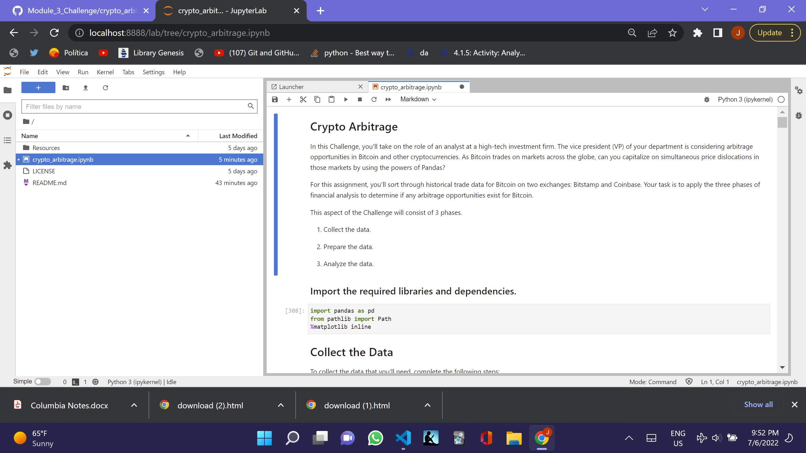

# Retirement Stock Fund Quantitative Analysis - Risk and Return

I am analyzing new investment options for inclusion in the clients' portfolios. Legendary fund and hedge-fund managers run all four selections. People sometimes refer to these managers as **whales**, because of the large amount of money that they manage. I will need to determine the fund with the most investment potential based on key risk-management metrics: the daily returns, standard deviations, Sharpe ratios, and betas.

Firstly, I will import the data, and create the daily returns dataframe, using the `pct_change` together with the `dropna` functions.

Secondly, I will analyze the performance, by using the `plot` function, and `cumprod` to calculate the cumulative returns.

Thirdly, I will analyze volatility, by using the `plot.box` function and parameter to visualize the daily return data and then I will use the `drop` function to drop the S&P 500 data to only look at the four funds. I will note which fund has the highest and lowest spread.

Fourthly, I will analyze the risk, by using the standard deviation `std` function for each of the 4 portfolios. Based on the annualized standard deviation, I will analyze whether any of the funds have a higher standard deviation than the S&P 500, and, therefore, are more risky.

Fifthly, I will analyze the risk-return profile through the use of the Sharpe Ratio by finding the mean annualized average return data and dividing it by the annualized standard deviation.

Finally, I will diversify the portfolio, by recommending two portfolios that I consider to be good investment opportunities. I will evaluate their betas, by dividing the covariance of the portfolio by the variance of the S&P 500. Then, I will decide in which portfolio to invest.

## Technologies

This was developed with Anaconda, which includes Pandas, Matplotlib and Jupyter_Lab and I created it in a development environment running Python 3.7.13.

---

## Installation Guide

To install the programs to run the program, you have to do the following or you can open 'risk_return_analysis.ipynb' in github and read the file there.

Install Anaconda and Python. </br>

Git clone the repo and run it, pursuant to the following clone address

git clone https://github.com/JeffSmith-ok/Module_4_Challenge

cd Module_4_challenge

In the terminal type 'Jupyter Lab'

---

## Usage

The following images show the notebook read in Juypter Lab and in Github under risk_return_analysis.ipynb.

##  </br>

## 

---

## Contributors

This is the fourth of the individual learning challenges.

My contact information is:

Name: Jeffrey M. Smith </br>
Linkedin: https://www.linkedin.com/in/jeffsmith77/ </br>
Personal email: jsmith@lexsmith.finance </br>
Phone: 332 238 5209

---

## License

MIT License

Copyright (c) 2022 Jeffrey M. Smith

Permission is hereby granted, free of charge, to any person obtaining a copy of this software and associated documentation files (the "Software"), to deal in the Software without restriction, including without limitation the rights to use, copy, modify, merge, publish, distribute, sublicense, and/or sell
copies of the Software, and to permit persons to whom the Software is furnished to do so, subject to the following conditions:

The above copyright notice and this permission notice shall be included in all copies or substantial portions of the Software.

THE SOFTWARE IS PROVIDED "AS IS", WITHOUT WARRANTY OF ANY KIND, EXPRESS OR IMPLIED, INCLUDING BUT NOT LIMITED TO THE WARRANTIES OF MERCHANTABILITY, FITNESS FOR A PARTICULAR PURPOSE AND NONINFRINGEMENT. IN NO EVENT SHALL THE AUTHORS OR COPYRIGHT HOLDERS BE LIABLE FOR ANY CLAIM, DAMAGES OR OTHER LIABILITY, WHETHER IN AN ACTION OF CONTRACT, TORT OR OTHERWISE, ARISING FROM, OUT OF OR IN CONNECTION WITH THE SOFTWARE OR THE USE OR OTHER DEALINGS IN THE
SOFTWARE.

```

```
